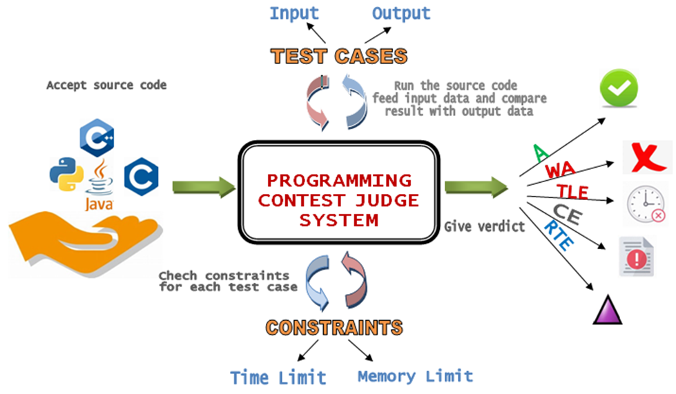

<h1>Programming Contest Judge System</h1>

Online programing contest judge system is developed by <b>Laravel</b> framework and here are some description about the system and installation procedures.



Programming Contest Judge System is a web application that is developed to evaluate (judge) the algorithmic source code submitted by the users and tests it against various test cases and constraints. It also hosts Competitive Programming Contests as well and produces contest results, which usually called score boards for every contest. Users are also able to practice by submitting any problem after the contest ends. 

 The system can compile and execute code, and test the source code with pre-constructed data. Submitted source code may be run with restrictions, including time limit, memory limit, security restriction and so on. The output of the code will be captured by the system, and compared with the standard output. The system will then return the result. The common results for a specific submissionare:Accepted, Wrong Answer, Time Limit Exceeds, Memory Limit Exceeds, Run Time Error, and Compilation Error.
 
Programming Contest Judge Systemposes problems such as questions in programming contests to users, receives their answers from the users, and checks the correctness of the submitted answers. Checking programs’ correctness implies decision problem of programs’ termination, and therefore it is not been decidable. Thus, the program checking is restricted to an approximation of correctness checking, in which a submitted and the submitted codes are compared with the output data generated by the correct answer programs installed in advance.

<h1>INSTALLATION</h1>
<h2>Step 1: Install Required Software</h2>
Before getting started, ensure that your machine meets the system requirements for running Laravel projects. You’ll need to have the following software installed:<br>
<b>PHP:</b> Install the latest stable version of PHP on your machine. You can download it from the official PHP website (https://www.php.net/downloads.php).

<b>Composer:</b> Laravel relies heavily on Composer, a dependency management tool for PHP. Install Composer by following the instructions on the Composer website (https://getcomposer.org/download/).

<h2>Step 2: Clone the Repository</h2>
Open your terminal or command prompt.<br>
Navigate to the directory where you want to store the project.<br>
Run the following command to clone the repository:

```console
git clone https://github.com/Yibarek/online-judge
```

<h2>Step 3: Install Dependencies</h2>
To ensure all required packages and dependencies are installed, you need to run the Composer install command:
Navigate to the project directory in your terminal.

Execute the following command to install the project dependencies:
```console
composer update
```

<h2>Step 4: Set Up Environment Configuration</h2>
Most Laravel projects require environment-specific configurations, such as database credentials and application settings. Follow these steps to set up the environment configuration:
In the project’s root directory, locate the .env.example file.

Create a copy of this file and rename it to .env.

Open the .env file and configure the necessary environment variables, such as the database connection details.

<h2>Step 5: Generate Application Key</h2>
Laravel requires an application key to secure session data and other sensitive information. Generate a unique application key by executing the following command: 

```console
php artisan key:generate
```
<h2>Step 6: Migrate the Database</h2>
Create a Database called <b>judge</b> on your mySQL DBMS and  run the following commands in your terminal to migrate the database:
Migrate the database tables:

```console
php artisan migrate
```

<h2>Step 7: Launch the System:</h2>
In your terminal, navigate to the project directory.
Start the development server by executing the following command:

```console
php artisan serve
```

Open your web browser and visit http://localhost:8000 (or the specified port) to access the running Laravel project.
